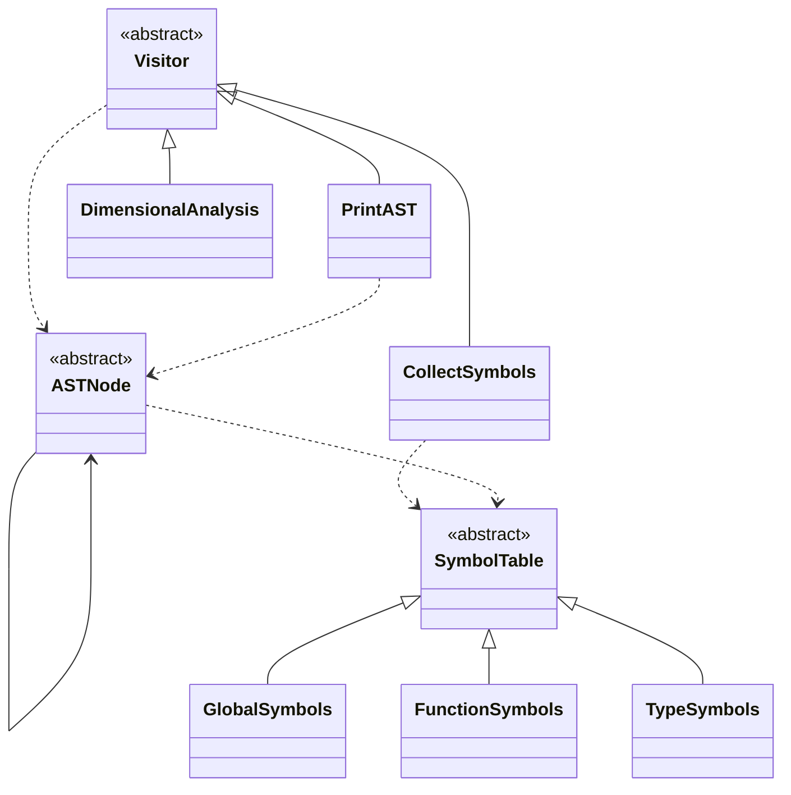
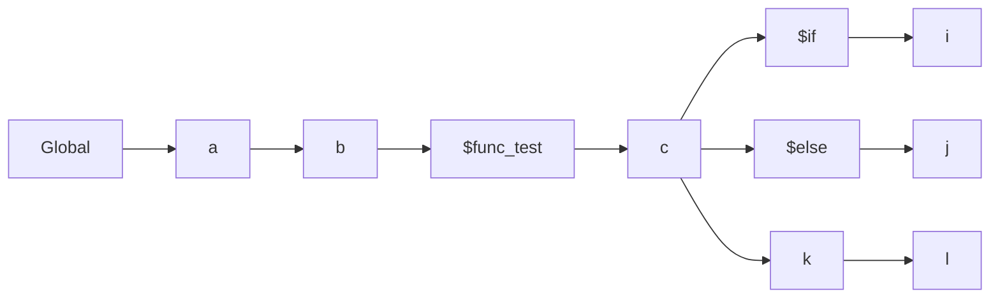
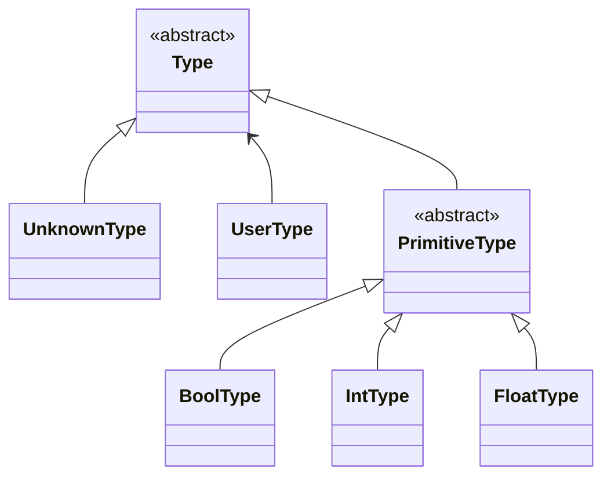
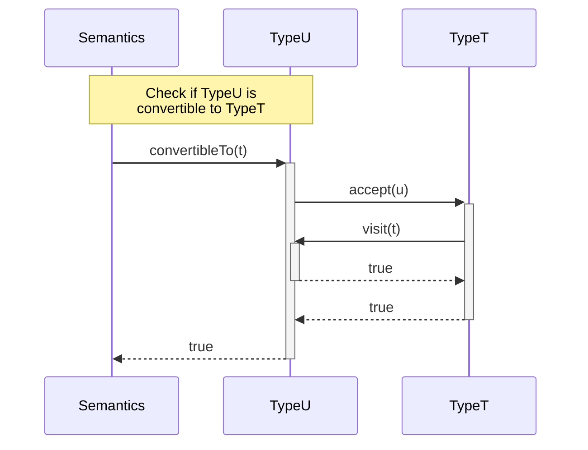
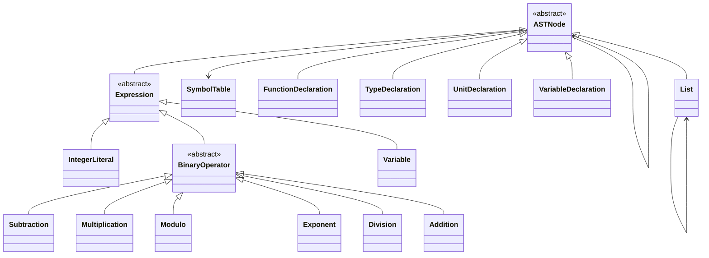
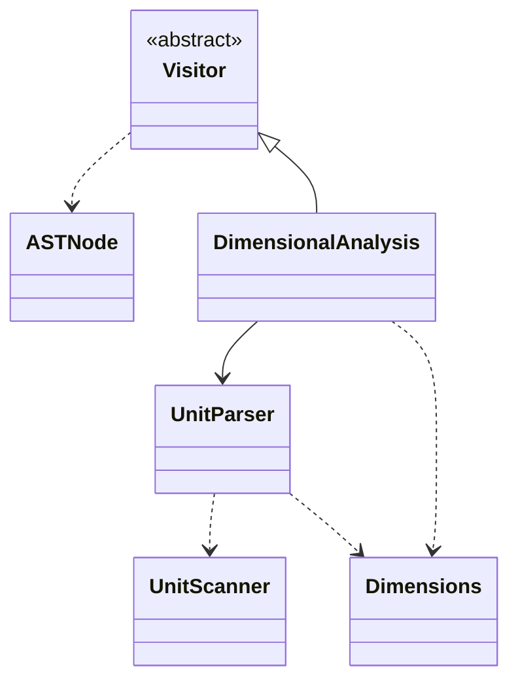

# Sprokit Compiler

## Class Structure


## Symbol Table
```
var a
var b
func test() {
	var c
	if {
		var i
	} else {
		var j
	}
	var k
	var l
}
```


## Abstract Data Types




### Abstract Syntax Tree


### Dimensional Analysis


## Finite State Machines
The json files in this directory are FSM exported from https://www.cs.unc.edu/~otternes/comp455/fsm_designer/.