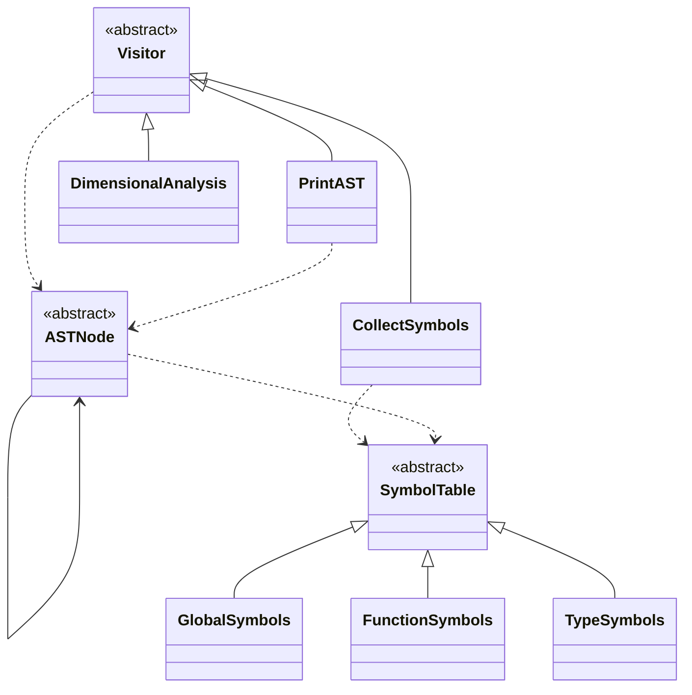
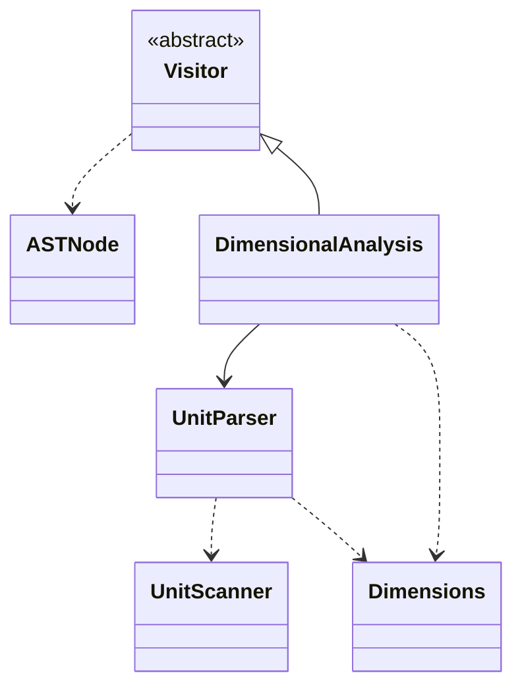

# Sprokit Compiler

## Class Structure

### Abstract Syntax Tree

### Dimensional Analysis

## Finite State Machines
The json files in this directory are FSM exported from https://www.cs.unc.edu/~otternes/comp455/fsm_designer/.